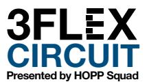
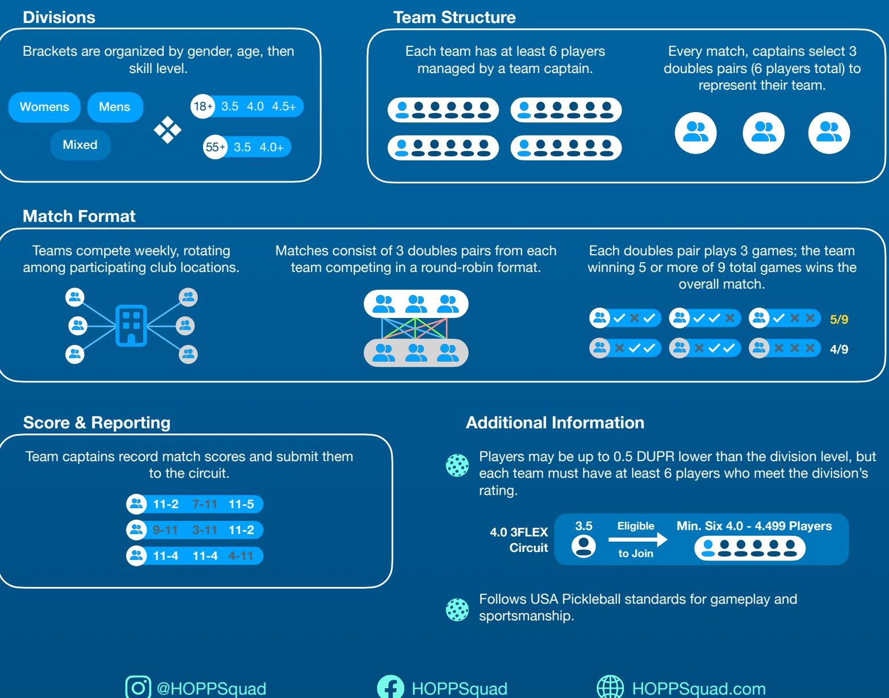
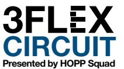

## **Why You'll Love 3FLEX**

**Bring Your Own Team:** Compete alongside your chosen teammates all season—no random pairings, just strategic, cohesive pickleball action.

**Fresh Competition Every Week:** Match up against diverse teams from across your area at local clubs, ensuring unique and exciting challenges every time you step on court.

**High-Level Matches:** Tailored specifically for committed amateurs and aspiring semi-pros craving consistently competitive play.

**Climb the Rankings, Win Prizes:** Battle it out for seasonal rankings, exclusive tournament awards, and ultimate bragging rights.

**A Better Alternative to Ladder Leagues:** Say goodbye to random partners and inconsistent matches; experience structured team play focused on strategy, camaraderie, and reliability.

**Reliable, Organized Events:** Enjoy weekly, professionally managed match-ups designed for seamless participation and optimal excitement.

**Play on Your Schedule:** Flexible participation lets you play regularly or step in whenever your team needs you most.

**Affordable, Pay-As-You-Play:** Forget upfront costs—pay only for matches you actually play, keeping competition accessible and budget-friendly.

#### **Have Questions?**  Contact us at 3Flex@hoppsquad.com

# **3FLEX at a Glance**

### ` **Your Role as Captain**

### **Managing a Team Roster**

**Team Size:** Maintain between **6 to 10 players** for gendered circuits and **6 to 12 players** for mixed circuits on your roster throughout the season.

**Weekly Lineups:** Field 3 doubles pairs (6 players) each week —captains create lineups based on availability, matchups, and team chemistry. **Lineups must be locked in at least 2 hours before match time.**

**Playoff Eligibility:** To qualify for playoffs, each player must participate in **at least 2 regular-season matches**.

**Roster Flexibility:** Add or drop players anytime during the season. New players must join **before the roster deadline** and can only play for **one team per season**.

**Minimum Requirement:** Teams dropping below 6 active players must recruit eligible replacements promptly to avoid **match forfeits or playoff disqualification**.

## **Score Reporting**

**Quick & Easy Submissions:** Captains submit match scores through the circuit's online platform within 24 hours of play.

**Verify or Confirm:** If the opposing captain enters scores first, simply review and approve them—only flag if something's off.

**Dispute Resolution:** The circuit will contact both teams if there's a scoring conflict. If no resolution is reached, the match may be voided, which could impact standings and playoff eligibility.

*Before leaving the court, have players confirm scores with their opponents to avoid disputes.*

## **Communication**

**Easy Lineup Management:** Lock in your weekly lineup through our online platform—your players are automatically notified.

**Timely Notifications:** Your finalized lineup is shared with the opposing captain **30 minutes before match time**.

**Player Absences:** Players inform captains directly about availability issues. Captains manage substitutions promptly.

**Handling Defaults:** If no substitutes are available, captains must immediately inform the opposing team about any defaulted matches.

*Court scheduling, payments, and match logistics are managed entirely by the circuit—allowing captains to focus purely on their teams.* 

## **Rule Enforcement**

**Official Standards:** All matches follow USA Pickleball rules and the circuit's Player Handbook for gameplay and sportsmanship.

**Captain Leadership:** Captains serve as the first point of contact for resolving match-related issues. Use the Player Handbook found on our website to guide minor disputes.

**Circuit Support:** If a situation can't be resolved using circuit resources, captains may escalate the issue to circuit staff for review.

**Match Balls:** The official circuit ball is the **Franklin X40**. The designated home team must provide **6 new balls** for each match to ensure smooth, uninterrupted play.

## **Team Leadership**

As captain, you shape your team's culture. The circuit encourages you to lead with **fairness, positivity, and inclusion** building camaraderie and healthy competition.

Captains are also responsible for setting the tone on **sportsmanship, communication, and team coordination** throughout the season.

**3FL X CIRCUIT Presented by HOPP Squad**

*Remember: Pickleball is community-driven at its core. Keep it fun, uplifting, and team-first.*

## **Why Partner With Us?**

**Our 3FLEX Circuit helps clubs increase court utilization, boost revenue, and grow visibility—without adding operational burden.**

### **What Your Club Gains**

### **Revenue & Utilization**

#### **Reliable Revenue Stream**

Clubs receive court fees for hosting circuit matches, generating consistent income with minimal overhead.

#### **Seasonal Court Utilization**

Circuit matches help clubs maintain strong court activity and revenue during slower participation seasons.

### **Growth & Exposure**

#### **New Player Exposure**

Circuit play draws high-level players from across the region, creating opportunities for new memberships and increased engagement.

#### **Expanded Brand Visibility**

Partner clubs are featured in circuit promotions, social media, and our website—boosting recognition within the broader pickleball community.

### **How Club Hosting Works**

### **Match Hosting**

Host matches for **1–2 teams per division**, based on your availability

Each match block requires **3 courts for 90 minutes** 

Hosting rotates weekly among clubs, reducing strain on your schedule

### **Scheduling & Coordination**

Court availability is confirmed **preseason** for designated match days and times

Weekly availability is submitted through our **online platform** 

Full schedules are shared in advance for easy planning

### **Operational Simplicity**

#### **Minimal Operational Lift**

The circuit manages all scheduling, logistics, and administration—clubs only need to provide court space.

#### **Shared Responsibility Model**

The rotating host format ensures hosting duties are balanced across clubs, allowing flexible participation without long-term strain.

### **Community**

#### **Enhanced Community Presence**

Hosting circuit matches builds goodwill, strengthens local ties, and positions your club as a competitive and social hub.

#### **Opportunities for Premium Events**

Clubs may be selected to host playoff or championship events, bringing additional traffic, attention, and prestige.

### **Low-Lift Commitment**

No involvement in logistics, team coordination, or scorekeeping

Circuit staff handles all operations

Clubs are paid directly by the circuit for each match hosted

# **Targeted Club Partners**

We're currently in conversations with leading clubs around the Twin Cities to build our launch lineup.

## **Our Player Base**

3Flex Circuit will launch with **12 divisions** across men's, women's, and mixed formats—split by **18+ and 55+ age brackets** and **3.5 and 4.0 skill levels**—with an expected **288 to 432+ players**, based on 4 to 6 teams per division and **team rosters ranging from 6 to 10 players**.

**Want to partner with us?**  Email us at 3Flex@hoppsquad.com or visit HOPPSquad.com

